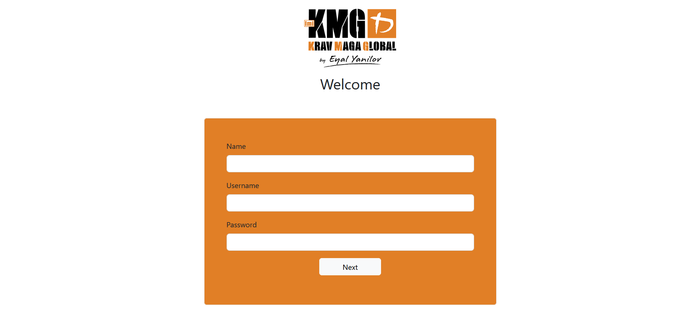
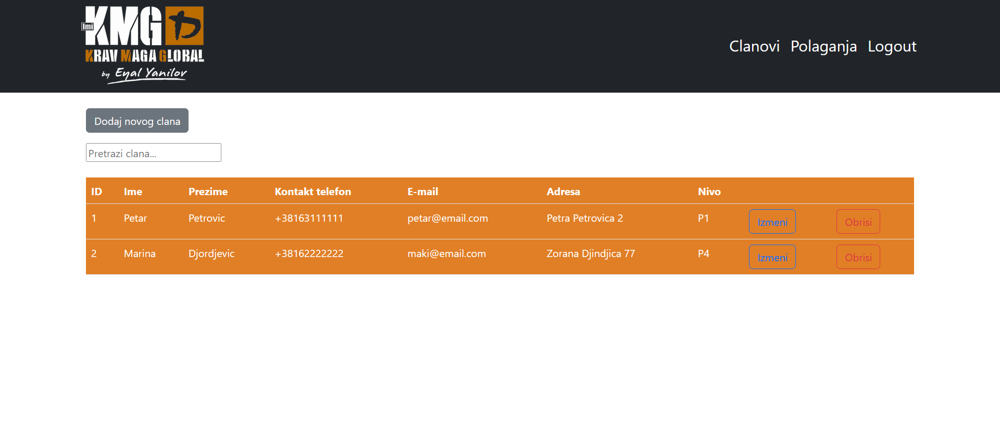
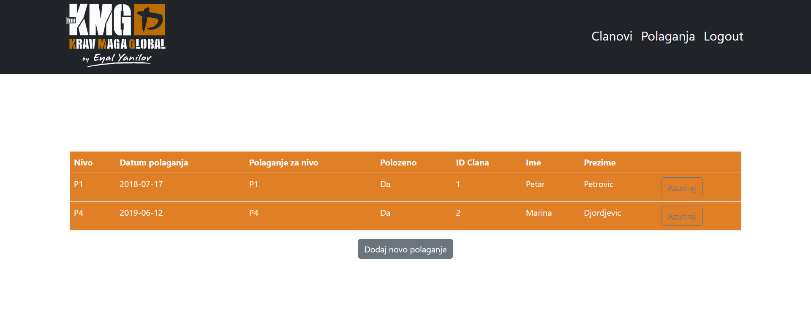

# CRUD Operations with PHP - Internet Tehnologije Project

## Project Overview

This project was developed as part of the Internet Tehnologije course during bachelor's studies. The objective was to implement a web application that performs CRUD (Create, Read, Update, Delete) operations on two connected tables within a database. The project utilizes PHP for backend logic and MySQL for database management, enabling users to manage members (`clanovi`) and their exam results (`polaganja`).

## Application Workflow

1. **Form Submission**: The login form is displayed on the `login.php` page. When a user enters their username and password and submits the form, a POST request is sent to the same page.



**Processing Login**:

-  The script checks if the `username` and `password` fields are set.
-  It creates a `User` object with the provided username and password.
-  The `logInUser` method is called on the `User` object, which interacts with the database to check if the provided credentials match an existing user.
-  If the credentials are valid, the user's ID is stored in the session using `$_SESSION["user_id"]`.
-  The user is then redirected to `clanovi.php`.

2. **Viewing Members**: Upon login, the user can view a list of members on `clanovi.php`. The application fetches member data from the database using the methods defined in `clan.php`.



3. **CRUD Operations**:

   -  **Create**: Clicking the Add Member button opens a modal form (implemented in HTML and styled with Bootstrap). When the user submits the form, `createClan.php` is called via AJAX, which processes the request and adds the member to the database.
   -  **Read**: Member data is displayed in a table format. Each row includes buttons for editing and deleting.
   -  **Update**: Clicking the Edit button opens a modal pre-filled with the member's current information. When submitted, `updateClan.php` is invoked to update the member's data.
   -  **Delete**: The Delete button triggers a confirmation dialog. If confirmed, `deleteclan.php` is called to remove the member from the database.

4. **Exam Management**: Similar functionality exists in `polaganja.php` for managing exam records using `createPolaganje.php`, `updatePolaganje.php`, and `deletePolaganje.php`.



5. **Search**: A search bar on `clanovi.php` enables users to filter members dynamically. An AJAX request is sent to the server with the search query, which retrieves matching members and updates the displayed list without refreshing the page.

6. **Logout Process**
   -  **Session Management**: The logout functionality starts a session using `session_start()`.
   -  The `unset` function is used to remove the `user_id` from the session, effectively logging the user out.
   -  The user is redirected back to the `login.php` page.

## Features

The project implements the following features:

-  **Create**: Add new members and exam results.
-  **Read**: View a list of all members and their exam results.
-  **Update**: Edit the details of existing members and their exams.
-  **Delete**: Remove members or exam records from the database.
-  **Search**: Search for members by name or other criteria.

## Technologies Used

-  **Backend:** PHP - Used to handle server-side logic, connecting to the database and processing CRUD requests.
-  **Frontend:**
   -  HTML (web strucure)
   -  CSS (Bootstrap for styling)
   -  JavaScript (AJAX): For asynchronous page updates and smooth interaction between client and server.
-  **Database:** MySQL
-  **XAMPP**: A development environment used to run Apache (web server) and MySQL (database).

## Project Structure

The project is organized into the following files and folders:

```
domaci1/
├── .git/
├── clanovi.php
├── dbBroker.php
├── Dokumentacija za PHP.docx
├── iteh1.sql
├── login.php
├── logout.php
├── polaganja.php
├── css/
├── handler/
│   ├── createclan.php
│   ├── createPolaganje.php
│   ├── deletePolaganje.php
│   ├── updateclan.php
│   └── updatePolaganje.php
├── inc/
│   ├── header.php
│   └── footer.php
├── img/
├── js/
│   └── main.js
└── model/
    ├── clan.php
    ├── polaganje.php
    └── user.php

```

## Database Structure

### Tables

1. **Clanovi (Members)**

-  `id`: Primary key
-  `ime`: Member's first name
-  `prezime`: Member's last name
-  `telefon`: Contact phone number
-  `email`: Email address
-  `adresa`: Address
-  `nivo`: Member's skill level (linked to exam results)

2. **Polaganja (Exams)**

-  `id`: Primary key
-  `nivo`: Skill level of the exam
-  `datum`: Date of the exam
-  `za_nivo`: Target level for the exam
-  `polozio`: Whether the member passed the exam or not
-  `id_clana`: Foreign key referencing the id from clanovi table

## How to Run the Project

### Prerequisites

-  Web Server: Apache (XAMPP, WAMP, or MAMP)
-  PHP: 7.x or higher
-  MySQL: 5.x or higher
-  Browser: Chrome, Firefox, or any modern browser

### Steps

1. Clone the Repository

```
git clone https://github.com/Filipovic13/iteh1-PHP
```

2. Set Up the Database

-  Open phpMyAdmin or any MySQL client.
-  Create a new database (e.g., `teh1`).
-  Import the SQL file (`iteh1.sql`) or manually create the two tables (clanovi and polaganja) following the schema described above.

3. Configure the Database Connection

In the `dbBroker.php` file, configure your database connection by updating the following values, so they match your local MySQL settings:

```
$host='localhost';
$db='iteh1';
$user='root';        # Change this if using a different user
$pass='';            # Add your MySQL root password if any
```

4. Run the Project

-  Place the project folder inside your web server directory (e.g., htdocs for XAMPP).
-  Start Apache and MySQL through XAMPP (or any web server stack).
-  Visit the application by navigating to `http://localhost/your-project-folder/clanovi.php` to access the application.

5. Using the Application

-  Navigate to `clanovi.php` to view, add, or manage members.
-  Navigate to `polaganja.php` to view, add, or manage exams.
-  Use the search bar on the members page to search for specific members.
